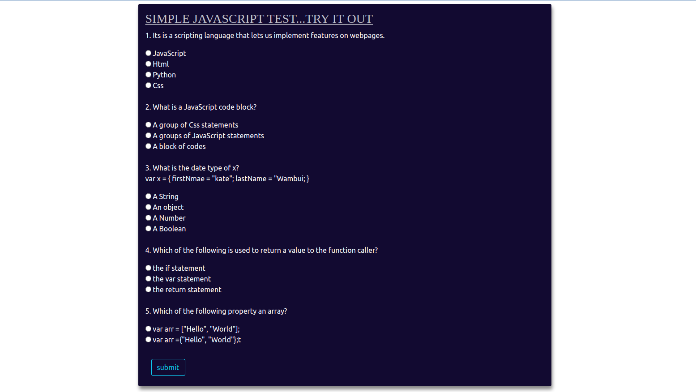

# A JavaScript QuizBoard

#### Version v1.0.3

### By Catherine Kimani

### Hoods

## Table of Content

+ [Description](#description)
+ [Live Link](#live-link)
+ [Installation Requirement](#Installation)
+ [Technology Used](#technology-used)
+ [Licence](#licence)
+ [Authors Info](#author-Info)

## Description
This is a JavaScript quiz board project which includes Javascript questions to test Moringa students who recently graduated.
The quizBoard also has an image and includes diffrent styles

## Live Link
https://catherinekimani.github.io/QuizBoard-IP3/

## Installation

### Requirements
* Ensure you have access to a browser
* Click on the live link in the about section https://catherinekimani.github.io/QuizBoard-IP3/
* Have fun!!!

[Go Back to the top](#a-javascript-quizboard)

## Technology Used
* HTML
* CSS
* JAVASCRIPT

## Licence

MIT License

Copyright (c) [2022] [MIT License](LICENCE)

[Go Back to the top](#a-javascript-quizboard)

## Authors Info

Linked - [Catherine Kimani](https://www.linkedin.com/incatherine-kimani/)

